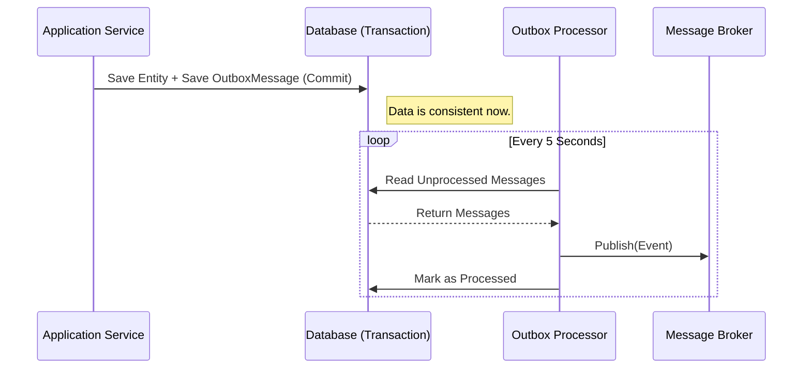

# Transactional Outbox Pattern Documentation

This document explains the implementation of the **Transactional Outbox Pattern** in our Enterprise Invoice Platform.

## 1. Overview
The Outbox Pattern ensures data consistency between our microservices/modules without using distributed transactions (2PC). It guarantees that **database updates** and **event publishing** happen atomically.

### Why we use it
When we save an Invoice to the database and want to publish an `InvoiceCreated` event:
*   **Without Outbox:** If the database saves but the message broker fails, we have data inconsistency.
*   **With Outbox:** We save the event to a local `OutboxMessage` table in the *same transaction* as the entity. A background process then reliably publishes it.

## 2. Implementation Components

### 2.1 The Outbox Table (`OutboxMessage`)
*   **Location:** `Shared.Infrastructure.Outbox.OutboxMessage`
*   **Role:** Stores the event payload in the database.
*   **Columns:**
    *   `Id`: Unique ID
    *   `Type`: Event name (e.g., "InvoiceCreated")
    *   `Content`: JSON payload of the event
    *   `OccurredOnUtc`: Timestamp
    *   `ProcessedOnUtc`: Null if not sent, Timestamp if sent.

### 2.2 The Interceptor (`ConvertDomainEventsToOutboxMessagesInterceptor`)
*   **Location:** `Shared.Infrastructure.Interceptors`
*   **Role:** Automatically captures Domain Events before they are lost.
*   **How it works:**
    1.  Intercepts `DbContext.SaveChangesAsync()`.
    2.  Finds all entities with pending Domain Events.
    3.  Serializes events to JSON.
    4.  Creates `OutboxMessage` records.
    5.  Saves everything in one atomic database transaction.

### 2.3 The Processor (`OutboxProcessor`)
*   **Location:** `Shared.Infrastructure.Outbox.OutboxProcessor`
*   **Role:** A background worker (`BackgroundService`) that polls for unsent messages.
*   **Workflow:**
    1.  Runs every 5 seconds.
    2.  Queries `OutboxMessage` table for records where `ProcessedOnUtc` is null.
    3.  Publishes the payload to the Message Broker (RabbitMQ).
    4.  Updates `ProcessedOnUtc` to mark as done.

## 3. How to Use
You do not need to manually save to the Outbox. Just use Domain Events normally:

```csharp
// 1. Create your entity
var invoice = new Invoice(...);

// 2. Add a domain event (Mechanism provided by AggregateRoot)
invoice.Raise(new InvoiceCreatedEvent(invoice.Id));

// 3. Save changes
// The Interceptor will automatically catch the event and save it to the Outbox table.
await _dbContext.SaveChangesAsync();
```

## 4. Diagram

